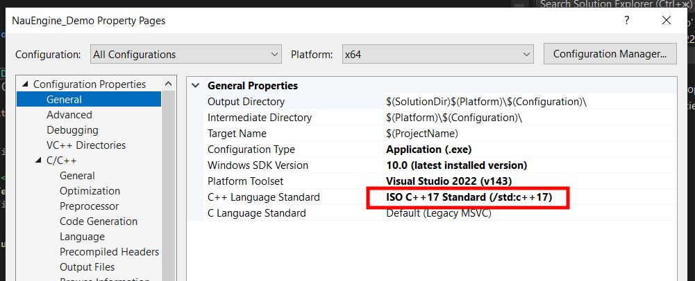
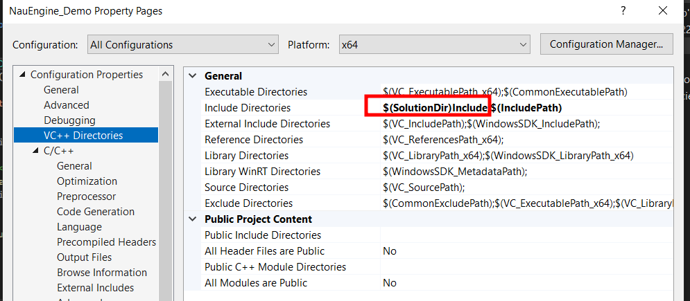
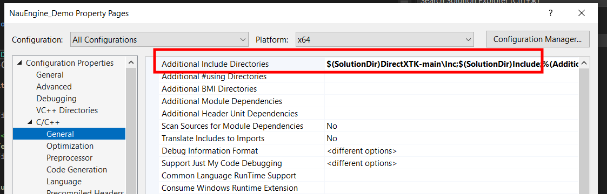
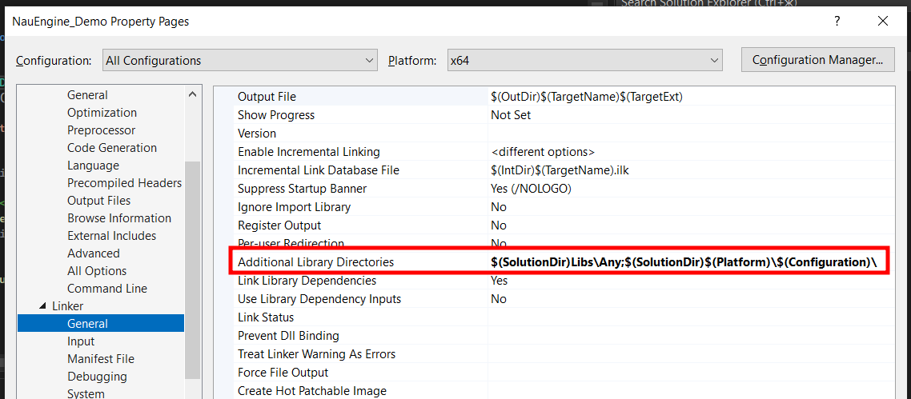
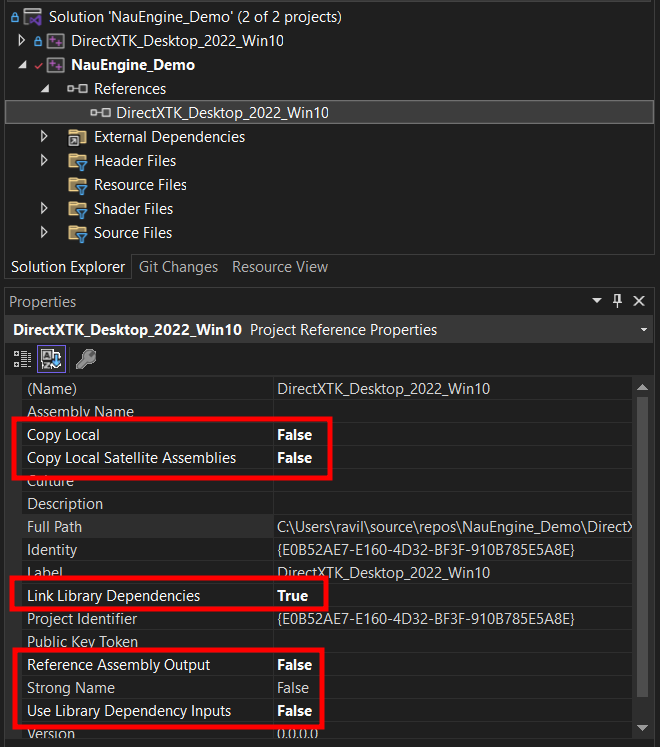

# NauEngine_Task

## Оглавление
1. [Прогресс](#прогресс)
2. [Архитектурные решения и обоснование выбора](#архитектурные-решения-и-обоснование-выбора)
3. [Документация](#документация)
  1. [Настройка проекта](#1-настройка-проекта)
  2. [Ресурсы](#2-ресурсы)
  3. [Сериализация](#3-сериализация)
  4. [Добавление объектов](#4-добавление-объектов-на-сцену)


## Прогресс

* **Задание 1** - Работает
    TO-DO:
        проверить везде ли правильные типы указателей;

* **Задание 2** - Сделано

* **Задание 3** - ещё не закончено

* **Документация** - ожидается...


## Архитектурные решения и обоснование выбора

### 1. Общая архитектура

- **Паттерн Entity-Component-System (ECS):**
  - Сущность (Entity) - базовый классы без данных, от которого наследуются, например, игровые объекты
  - Компоненты (Component) - отдельные классы, хранящие специфичные данные (например, TransformComponent, RenderComponent) и логику соответсвующую этим данным.
  - Системы (System) - отдельные классы, реализующие логику обработки сущностей с определёнными компонентами (RenderSystem и ScriptingSystem[  не реализован  ])
  - Все компоненты хранятся внутри сущности через контейнер умных указателей, что обеспечивает гибкость и расширяемость архитектуры.

- **Менеджер ресурсов (ResourceManager):**
  - Централизованная система для загрузки, хранения и выдачи ресурсов (модели, шейдеры).
  - Использует кэширование для предотвращения повторной загрузки одних и тех же ресурсов.
  - Все ресурсы идентифицируются по уникальному ключу (путь к файлу).

### 2. Управление памятью: выбор умных указателей

- **std::shared_ptr** используется для ресурсов (модели, шейдеры):
  - Позволяет нескольким объектам или компонентам безопасно разделять один и тот же ресурс.
  - Ресурс автоматически освобождается, когда последний владелец перестаёт им пользоваться. Такой подход предотвращает утечки памяти и дублирование загрузки, а также упрощает архитектуру.
- **std::unique_ptr** применяется для компонентов внутри сущности:
  - Каждый компонент принадлежит только одной сущности, что соответствует семантике уникального владения.
  - Это обеспечивает строгий контроль времени жизни компонентов и предотвращает случайное совместное владение.
- **std::unique_ptr** применяется для сущностей:
  - Каждая сущность создаётся в одном экземпляре. Не нужно вручную освобождать память в деструкторе сцены, не возникает риска забыть удалить объект или удалить его дважды.

### 3. Формат сериализации: выбор и обоснование

- **JSON** выбран в качестве основного формата сериализации:
  - Читаемость: JSON-файлы легко читать и редактировать вручную, что удобно для отладки и тестирования.
  - Гибкость: Структура JSON легко расширяется новыми полями и компонентами без нарушения совместимости.
  - Поддержка библиотек: Для C++ существует множество удобных библиотек для работы с JSON. В данной работе использовалась nlohmann/json [https://github.com/nlohmann/json].
  - Для прототипа и тестового задания JSON - оптимальный выбор, так как он обеспечивает прозрачность и простоту интеграции. Для релизных версий можно рассмотреть бинарные форматы, если потребуется максимальная производительность и минимальный размер файлов.

### 4. Система сериализации

- Каждый компонент реализует функции сериализации и десериализации (to_json/from_json).
- В сериализуемых объектах сохраняются только ключи ресурсов, а не сами объекты, что позволяет избежать дублирования и упростить восстановление состояния через ResourceManager.
- Для поддержки полиморфизма (разные наследники Entity) в сериализуемых данных сохраняется тип каждого объекта, что позволяет корректно создавать нужные экземпляры при загрузке сцены.
- При десериализации сначала восстанавливаются все ресурсы в ResourceManager, затем восстанавливаются все объекты сцены с их компонентами, а также их связь с восстановленными ранее ресурсами.

## Документация

### 1. Настройка проекта

- В **Project Settings** проекта *NauEngine_Demo* должны быть выставлены следующие параметры (они стоят по умолчания):

  - General -> C++ Language Standart
  

  - General -> VC++ Directories
  

  - C/C++ -> General -> Additional Include Directories
  

  - Linker -> General -> Additional Library Directories
  

  - Linker -> Input -> Additional Dependences
  

- В References проекта *NauEngine_Demo* должен быть указан проект *DirectXTK-main* со следующими параметрами:

  

### 2. Ресурсы

- **Расположение ресурсов**
  - Ресурсы проекта располагаются в следующих директориях:

```
NauEngine_Demo/
│
├── NauEngine_Demo/
│   ├── Models
│   ├── Shaders
│   ├── Textures
│   └── ...
└── ...
```

- **Формат ресурсов**
  - Мэши - *.obj*
  - Шейдеры - *.hlsl*, ShaderModel 5.0, точка входа - *main*
  - Текстуры - *.dds*

### 3. Сериализация

- Сериализация происходит в файлы **resources.json** (ресурсы сцены) и **scene.json** (сущности, их компоненты, ключи ресурсов)

```
NauEngine_Demo/
│
├── NauEngine_Demo/
│   ├── resources.json
│   ├── scene.json
│   └── ...
└── ...
```

### 4. Добавление объектов на сцену

- Осущетсвляется в конструкторе класса **Game**:

```cpp
scene->AddEntity(std::make_unique<CustomEntity> (
  renderSystem->GetDevice(),
  "./Models/horse.obj", // Мэш объекта
  "./Textures/horse_Diffuse.dds" // Текстура объекта
  ));
```

### 5. Управление

- WASD - вперёд/назад, влево/вправо
- Q/E - вниз/вверх
- Esc - выход