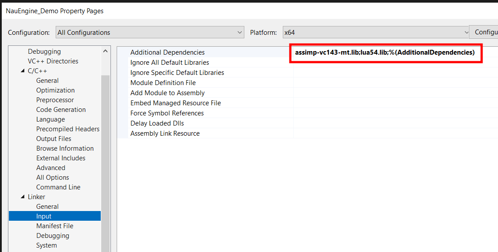

# NauEngine_Task

## Оглавление
1. [Прогресс](#прогресс)
2. [Архитектурные решения и обоснование выбора](#архитектурные-решения-и-обоснование-выбора)
3. [Документация](#документация)
    1. [Настройка проекта](#1-настройка-проекта)
    2. [Ресурсы](#2-ресурсы)
    3. [Сериализация](#3-сериализация)
    4. [Добавление объектов](#4-добавление-объектов-на-сцену)


## Прогресс

* **Задание 1** - Сделано
* **Задание 2** - Сделано
* **Задание 3** - Сделано


## Архитектурные решения и обоснование выбора

### 1. Общая архитектура

```
NauEngine_Demo/
|
├── resources.json
├── scene.json
│
├── Models/
│   └── ...
├── Textures/
│   └── ...
├── Shaders/
│   └── ...
│
├── LuaScripts/
│   └── ...
│   
├── ECS/
│   ├── Components/
│   │   ├── Component.cpp
│   │   ├── Component.h
│   │   ├── RenderComponent.cpp
│   │   ├── RenderComponent.h
│   │   ├── TransformComponent.cpp
│   │   └── TransformComponent.h
│   │   ├── LuaScriptComponent.cpp
│   │   └── LuaScriptComponent.h
│   ├── Entities/
│   │   ├── Camera.cpp
│   │   ├── Camera.h
│   │   ├── CustomEntity.cpp
│   │   ├── CustomEntity.h
│   │   ├── Entity.cpp
│   │   ├── Entity.h
│   │   ├── PlaneEntity.cpp
│   │   ├── PlaneEntity.h
│   │   ├── SimpleEntity.cpp
│   │   └── SimpleEntity.h
│   └── Systems/
│       ├── RenderSystem.cpp
│       ├── RenderSystem.h
│       ├── ScriptingSystem.cpp
│       └── ScriptingSystem.h
│   
├── ResourceManager/
│   ├── ResourceManager.cpp
│   ├── ResourceManager.h
│   └── Resources/
│       ├── ConstantBuffer.h
│       ├── Mesh.cpp
│       ├── Mesh.h
│       ├── PixelShader.cpp
│       ├── PixelShader.h
│       ├── Resource.cpp
│       ├── Resource.h
│       ├── Texture.cpp
│       ├── Texture.h
│       ├── TransformCBuffer.cpp
│       ├── TransformCBuffer.h
│       ├── VertexShader.cpp
│       └── VertexShader.h
│   
├── InputDevice/
│   ├── Delegates.cpp
│   ├── Delegates.h
│   ├── InputDevice.cpp
│   ├── InputDevice.h
│   └── Keys.h
│   
├── DisplayWindow.cpp
├── DisplayWindow.h
│  
├── Game.cpp
├── Game.h
│  
├── GameTimer.cpp
├── GameTimer.h
│  
├── main.cpp
│  
├── Scene.cpp
├── Scene.h
│  
└── StringHelper.h
```

- **Паттерн Entity-Component-System (ECS):**
  - Сущность (Entity) - базовый классы без данных, от которого наследуются, например, игровые объекты
  - Компоненты (Component) - отдельные классы, хранящие специфичные данные (например, TransformComponent, RenderComponent) и логику соответсвующую этим данным.
  - Системы (System) - отдельные классы, реализующие логику обработки сущностей с определёнными компонентами (RenderSystem и ScriptingSystem[  не реализован  ])
  - Все компоненты хранятся внутри сущности через контейнер умных указателей, что обеспечивает гибкость и расширяемость архитектуры.

- **Менеджер ресурсов (ResourceManager):**
  - Централизованная система для загрузки, хранения и выдачи ресурсов (модели, шейдеры).
  - Использует кэширование для предотвращения повторной загрузки одних и тех же ресурсов.
  - Все ресурсы идентифицируются по уникальному ключу (путь к файлу).

### 2. Управление памятью: выбор умных указателей

- **std::shared_ptr** используется для ресурсов (модели, шейдеры):
  - Позволяет нескольким объектам или компонентам безопасно разделять один и тот же ресурс.
  - Ресурс автоматически освобождается, когда последний владелец перестаёт им пользоваться. Такой подход предотвращает утечки памяти и дублирование загрузки, а также упрощает архитектуру.
- **std::unique_ptr** применяется для компонентов внутри сущности:
  - Каждый компонент принадлежит только одной сущности, что соответствует семантике уникального владения.
  - Это обеспечивает строгий контроль времени жизни компонентов и предотвращает случайное совместное владение.
- **std::unique_ptr** применяется для сущностей:
  - Каждая сущность создаётся в одном экземпляре. Не нужно вручную освобождать память в деструкторе сцены, не возникает риска забыть удалить объект или удалить его дважды.

### 3. Формат сериализации: выбор и обоснование

- **JSON** выбран в качестве основного формата сериализации:
  - Читаемость: JSON-файлы легко читать и редактировать вручную, что удобно для отладки и тестирования.
  - Гибкость: Структура JSON легко расширяется новыми полями и компонентами без нарушения совместимости.
  - Поддержка библиотек: Для C++ существует множество удобных библиотек для работы с JSON. В данной работе использовалась nlohmann/json [https://github.com/nlohmann/json].
  - Для прототипа и тестового задания JSON - оптимальный выбор, так как он обеспечивает прозрачность и простоту интеграции. Для релизных версий можно рассмотреть бинарные форматы, если потребуется максимальная производительность и минимальный размер файлов.

### 4. Система сериализации

- Каждый компонент реализует функции сериализации и десериализации (to_json/from_json).
- В сериализуемых объектах сохраняются только ключи ресурсов, а не сами объекты, что позволяет избежать дублирования и упростить восстановление состояния через ResourceManager.
- Для поддержки полиморфизма (разные наследники Entity) в сериализуемых данных сохраняется тип каждого объекта, что позволяет корректно создавать нужные экземпляры при загрузке сцены.
- При десериализации сначала восстанавливаются все ресурсы в ResourceManager, затем восстанавливаются все объекты сцены с их компонентами, а также их связь с восстановленными ранее ресурсами.

### 5. Интеграция скриптового языка Lua

- **LuaBridge 3 и LuaScriptComponent:**
  - Для интеграции скриптового языка я выбрал [LuaBridge 3](https://github.com/kunitoki/LuaBridge3) — современную header-only библиотеку для связывания C++ и Lua. Она поддерживает удобный синтаксис, захватывающие лямбды и работу с кортежами, что позволяет легко пробрасывать C++-функции в Lua.
  - Реализован компонент `LuaScriptComponent`, который хранит имя Lua-скрипта, прикреплённого к сущности. Это позволяет каждой сущности иметь собственное скриптовое поведение.

- **ScriptingSystem и выполнение скриптов:**
  - Добавлена система `ScriptingSystem`, которая находит все сущности с компонентом LuaScriptComponent, загружает и выполняет соответствующий Lua-скрипт.
  - Для каждой сущности создаётся, в который пробрасываются необходимые функции для управления компонентами сущности.
  - Скрипт вызывается системой ScriptingSystem каждый кадр для соответствующей сущности.

- **Binding API для управления TransformComponent:**
  - В Lua проброшены функции управления позицией и вращением сущности:
    - `engine.get_position()` — возвращает позицию объекта.
    - `engine.set_position(x, y, z)` — задаёт позицию объекта.
    - `engine.rotate(axisX, axisY, axisZ, angle)` — вращает объект вокруг заданной оси.
  - Эти функции реализованы через захватывающие лямбды и проброшены в Lua через LuaBridge 3, что обеспечивает чистый и понятный API для скриптов.

- **Обоснование выбора:**
  - LuaBridge 3 обеспечивает современный и удобный синтаксис, поддержку C++17, захватывающих лямбд и tuple, что упрощает проброс сложных функций и данных.
  - Такой подход позволяет реализовать расширяемое и безопасное взаимодействие между C++ и Lua, а также легко добавлять новые функции и компоненты для управления из скриптов.

**Пример использования в коде:**
```cpp
auto& transform = entity->GetComponent<TransformComponent>();
luabridge::getGlobalNamespace(L)
    .beginNamespace("engine")
    .addFunction("get_position", [&transform]() {
    auto pos = transform.GetWorldPosition();
    return std::make_tuple(pos.x, pos.y, pos.z);
        })
    .addFunction("set_position", [&transform](float x, float y, float z) {
    transform.SetWorldPosition(Vector3(x, y, z));
        })
    .addFunction("rotate", [&transform](float axisX, float axisY, float axisZ, float angle) {
    transform.LocalRotate(Vector3(axisX, axisY, axisZ), angle);
        })
    .endNamespace();
```

## Документация

### 1. Настройка проекта

- В **Project Settings** проекта *NauEngine_Demo* должны быть выставлены следующие параметры (они стоят по умолчания):

  - General -> C++ Language Standart
  

  - General -> VC++ Directories
  

  - C/C++ -> General -> Additional Include Directories
  

  - Linker -> General -> Additional Library Directories
  

  - Linker -> Input -> Additional Dependences
  

- В References проекта *NauEngine_Demo* должен быть указан проект *DirectXTK-main* со следующими параметрами:

  

### 2. Ресурсы

- **Расположение ресурсов**
  - Ресурсы проекта располагаются в следующих директориях:

```
NauEngine_Demo/
│
├── NauEngine_Demo/
│   ├── Models
│   ├── Shaders
│   ├── Textures
│   └── ...
└── ...
```

- **Формат ресурсов**
  - Мэши - *.obj*
  - Шейдеры - *.hlsl*, ShaderModel 5.0, точка входа - *main*
  - Текстуры - *.dds*

### 3. Сериализация

- Сериализация происходит в файлы **resources.json** (ресурсы сцены) и **scene.json** (сущности, их компоненты, ключи ресурсов)
- Сохранение сцены при нажатии кнопки **<1>**
- Загрузка сцены при нажатии кнопки **<2>**

```
NauEngine_Demo/
│
├── NauEngine_Demo/
│   ├── resources.json
│   ├── scene.json
│   └── ...
└── ...
```

### 4. Lua-скрипты

- **Расположение скриптов**
  - Скрипты проекта располагаются в следующей директории:

```
NauEngine_Demo/
│
├── NauEngine_Demo/
│   └── LuaScripts
└── ...
```

- **Содержание скрипта**
  - Скрипт обязательно должен содержать функцию `update(dt)` принимающий на вход одно число *dt*
  - Доступные в скрипте методы:
    1. `engine.get_position()` - возвращает кортеж из трёх координат (позицию объекта)
    2. `engine.set_position(x, y, z)` - задаёт позицию объекта по кооридинатам
    3. `engine.rotate(axisX, axisY, axisZ, angle)` - поворачивает объект вокруг оси (axisX, axisY, axisZ) на угол angle
    - **Пример Lua-скрипта:**
      Скрипт, который заставляет объект вращаться вокруг своей оси:
      ```lua
      function update(dt)
          engine.rotate(0, 1, 0, dt*10)
      end
      ```


### 5. Добавление объектов на сцену

- Осущетсвляется в конструкторе класса **Game**:
- SimpleEntity - простые летающие кубики
- PlaneEntity - летающий самолёт
- CustomEntity - объект с настраиваемыми мэшом, текстурой и скриптом поведения


```cpp
scene->AddEntity(std::make_unique<CustomEntity> (
  renderSystem->GetDevice(),
  "./Models/horse.obj", // Мэш объекта
  "./Textures/horse_Diffuse.dds", // Текстура объекта
  "./LuaScripts/Eight.lua" // скрипт объекта
  ));
```

### 6. Управление

- WASD - вперёд/назад, влево/вправо
- Q/E - вниз/вверх
- Esc - выход
- **<1>** - Сохранение сцены
- **<2>** - Загрузка сцены